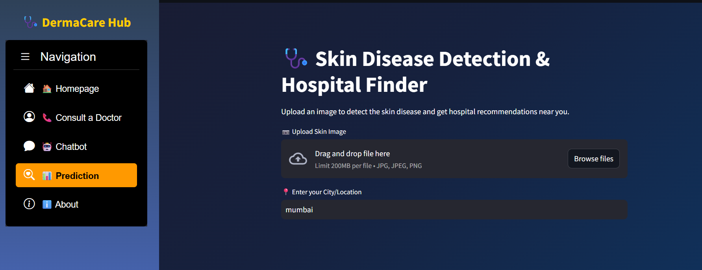
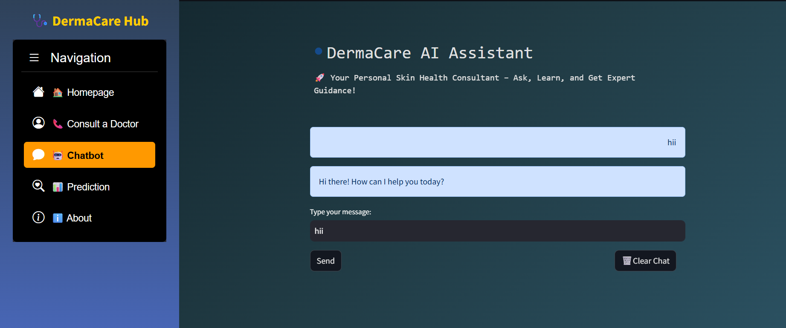
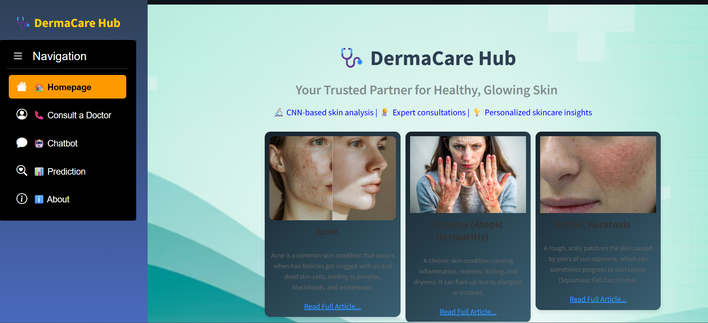

# 🧬 Skin Disease Detection System 🧬🧑‍⚕️

A **Smart Skin Disease Detection Web Application** built using **Machine Learning**, **Deep Learning**, and **Convolutional Neural Networks (CNN)**. This system analyzes skin images, predicts possible diseases, and assists users with **PDF reports**, **live hospital mapping**, **video consultancy**, and an **AI-powered chatbot assistant**.

---

## 🚀 Features

### 🧠 ML,CNN - Based Disease Detection
Upload a skin image and get instant predictions of skin conditions using a trained CNN model.  
Supported diseases:
- Actinic Keratosis
- Atopic Dermatitis
- Benign Keratosis
- Dermatofibroma
- Melanocytic Nevus
- Melanoma
- Squamous Cell Carcinoma
- Tinea / Ringworm / Candidiasis
- Vascular Lesion

---

### 🗺️ Live Hospital Location Mapping
Based on your location, the app finds and shows **nearby hospitals** on an interactive map using **Folium** and **Geopy**.

---

### 📄 PDF Report Generation
Automatically generate a detailed **diagnosis report** in PDF format, which includes:
- Disease name
- Explanation
- Uploaded image
- Doctor advice (if any)

---

### 🎥 Live Video Consultancy
Connect with dermatologists or health consultants through **live video conferencing** integrated into the platform.

---

### 🤖 Smart Chatbot Assistant
A friendly AI chatbot to:
- Answer common skin care questions
- Provide first-aid advice
- Assist with navigation and features

---

## 🛠️ Tech Stack

- **Frontend**: Streamlit, HTML/CSS
- **Backend**: Python, TensorFlow, Keras, OpenCV
- **ML/DL**: CNN for image classification
- **Geolocation**: Folium, Geopy
- **PDF Generation**: FPDF
- **Chatbot**: Python + NLP logic
- **Video Calling**: WebRTC / WebSocket.io

---

## 📸 Screenshots

> *Add screenshots or a demo video here if available.*
> ### 🖼️ Skin Disease Prediction Page  


### 🗺️ Hospital Location Mapping  


### 📄 PDF Report Example  


---

## Project Demo Link
https://skin-diagnose-detection-project-001.streamlit.app/

---

## 📦 Installation

```bash
git clone https://github.com/yourusername/skin-disease-detection.git
cd skin-disease-detection
pip install -r requirements.txt

